# Unidad didáctica 2 #

# Interpretacón del diseño conceptual del modelo Entidad/Relación #

## Contenido ##

- Unidad didáctica 2
- Interpretación del diseño conceptual del modelo Entidad/Relación
- Represenntación del problema
- El modelo de datos
- Modelo ENtidad/Relación
- Elementos del modelo Entidad/Relación
  - Entidades
  - Atributos 
  - Ocurrencia de una Entidad
  - Relaciones
  - Grado de una relación
  - Participación de la entidad en la relación
  - Cardinalidad de una relación
  - Atributos propios de una relación
  - Ocurecias de una entidad
  - Relaciones Reflexivas
  - Entidades fuertes y débiles. Relaciones de dependencia
  - Relciones n-arias
- Modelo Entidad/Relación extendido (EE/R)
- Definición
- Documentación del modelo de datos
- Consideraciones para la elección entre los distintos elementos del modelo E/R

## Objetivos ##

- [ ] Saber construir un Modelo E/R
- [ ] Identificar perfectamente las entidades y las relaciones
- [ ] Ubicar cada atributo en el lugar correspondiente
- [ ] No formar ciclos redundantes
- [ ] Obtener las cardinalidades de las relaciones
- [ ] Conocer las relacions jerárquicas y saberlas utilizar construyendo un modelo Entidad/Relación extendido
- [ ] Tener destreza analizando los datos de una aplicación
- [ ] Organizar la información que utiliza la aplicación de manera cherente mediante un modelo de datos

## Diseño conceptual de una base de datos ##

### Representación del problema ###

- El diseño de la base de datos consiste en extraer todos los datos relevantes de un problema. 
- Para extraer los datos se debe realizar un análisis del dominio del problema, para conocer qué datos sone senciales para la base de datos y poder descartar los que no son de utilidad. Una vez que conocemos los datos necesarios comienza el proceso de modelización, es decir, construir mediante una herramienta de diseño de base de datos ,un esquema que exprese con total exactitud todos los datos del problema necesita almacenar.
- Normalmente se analizan los datos a través de diversas reuniones con futuros usuarios del sistema. De dichas reuniones se obtiene un documento llamado Especificaión de Requisitos de Software (E.R.S)

### El modelo de datos ###

  1. **Estructura lógica**: Indica la distribución y la composición teórica de la base de datos. Una estructura que permite idealizar a la base de datos.
  2. **Estructura física**: Es la estructura de los datos tal cual se almacenan en las unidaddes de disco.

#### Metodología del diseño de una base de datos ####

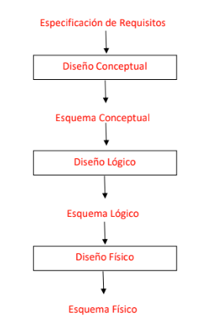

- **Especificaión de requisitos**: Averigua las necesidades del usuario de la BBDD
- **Diseño/Modelo conceptual**: Es el diseño al que corresponde el diagrama E/R.
- **Diseño/Modelo lógico**: Se transforman las entidades y relaciones del modelo anterior en tablas.
- **Diseño/Modelo físico**: Empleando el gestor de DDBB, se implementa las tablas de las DDBB con sus características.

## Modelo Entidad/Relación ##

Se trata de un modelo muy extendido y que ha experimentado a lo largo de los años una serie de implementaciones. Su éxito se deve a su capacidad para representar prácticamente todas las restricciones del diseño de base de datos.
Elementos que forman el modelo Entidad/Relación:
- Entidades
- Atributos
- Relaciones
- Grado de la ralación
- Cardinalidad de la relación
- Atributos propios 
- Claves Ocurrencias de una relación
- Participación de la entidad en la relación

### Entidades ###

  Una entidad es un objeto real o abstracto del cual queremos almacenar información en la base de datos. No se debe confundir con una ocurrencia, la cual es cada una de las realizaciones concretas de ese tipo de entidad. 

### Atributos ####

Son características o propiedades de aquello que representan le entidad. Al hablar de atributos hay que hablar también de dominios, que es el conjunto de valores que puede tomar un atributo.

 Tipos de atributos:

   - Atributo identificador : Distingue unívocamente una ocurrencia de entidad del resto de ocurrencias
  - Atributo identificador alternativo: Son otros atributos indentificadores pero menos importantes.
  - Atributo descriptor : Caracteriza a una ocurrencia de una entidad pero no la diferencia del resto de la ocurrencia.
  - Atributos Multivaluados/Multivalorados: Pueden tomar mas de un valor.
  - Atributos monovalorados: Solo pueden tener un valor.
  - Atributos compuestos : Es un atributo que tiene atributos mas específicos.
  - Atributos obligatorio u opcional : Si un atributo debe tomar un valor o no.
  - Atributos derivados : Es un atributo en el que su valor se obtiene a partir de otros elementos del esquem E/R.

### Relaciones ###

  Una relación es una asociación entre entidades con ciertas restricciones determinadas por las entidades participantes en la relación.
  El grado de una relación indica el número de entidades sobre las que se realiza la asociación. Las relaciones son **Binarias(2 entidades distintas)**, **Reflexivas(consigo mismo)**, **Ternarias(3 entidades)**, **N (+3 entidades)**.
  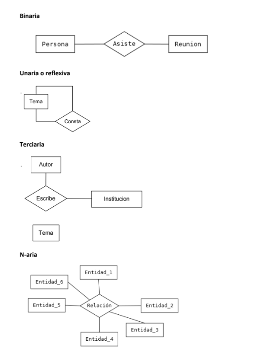

### Participación de la entidad de la relación ###

  Consiste en indicar exactamente cuál es la participación de una entidad en la relación. Para ello, se define el número mínimo y máximo de ocurrencias de una entidad.
  
  - Participación mímima:
    - Participación mínima cero: Significa  que puede haber ocurrencias de una entidad que no estén asociadas a ninguna ocurrencia de la otra entidad.
    - Participación mínima uno: Significa que toda ocurrencia de una entidad debe estar asociada a una ocurrencia de la otra entidad.

### Cardinalidad de una relación ###

  La cardinalidad es el tipo de asociación establecida entre las entidades.
  - Cardinalidad 1:1 : Una ocurrencia se asocia como máximo acon una única ocurrencia de entidad.
  - Cardinalidad 1:N : Una ocurrencia de la entidad A se asocia con un indeterminado número de ocurrencias de la entidad B, pero cada ocurencia de la entidad B sólo se le corresponde una ocurrencia de la entidad A.
  - Cardinalidad N:N : Una ocurrencia de entidad se asocia con un número indeterminado de ocurrencias de entidad y viceversa.
  
### Atributos propios de una relación ###

Son aquellos atributos cuyo valir sólo se puede obtener en la relación, puesto que dependen de las entidades que participan en la relación.
Ejemplo :
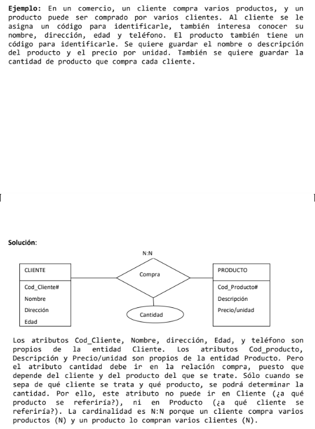

### Entidades fuertes y débiles. Relaciones de dependencia ###

Existen dos tipos de entidades:
- **Entidades fuerte**: No dependen de ninguna otra.
- **Entidades débiles**: Dependen de otra entidad.

Tipos de dependencia: 
 - Dependencia en existencia: Se produce cuando la entidad débil necesita a la fuerte para existir. Si desaparece la ocurrencia de la entidad fuerte, la débil carece de sentido.
   - Empleado tiene un hijo. (Hijo depende de empleado por lo que si quitamos empleado, hijo pasa a no tener sentido). 
 - Dependencia en identificación: Se produce cuando la entidad débil necesita a la entidad fuerte para identificarse. Por sí sola, la débil no es capaz de identificar de manera unívoca sus ocurrencias.
   - Las provincias tienen municipios (En este caso si eliminamos la entidad Provincias, Municipios sigue teniendo sentido por si solo pero no se puede identificar). 

### Modelo Entidad/Relación Extendido ###

Contiene todos los elementos anteriores más las relaciones jerárquicas.
Una **relación jerárquica** se produce cuando una entidad se puede subdividir en otras, la cuales mantienen una relación **ES_UN** con la anterior.
Las relaciones jerárquicas también se les llama relaciones ES_UN y tienen las siguientes propiedades:
  - La relacioón jerárquica puede ser n-aria.
  - Las entidades subconjunto heredan prodiedades y el comportamiento de la entidad superconjunto(**herencia**).
  - El comportamiento y las propiedades de la entidad subconjunto puede cambiar respecto al resto de entidades subconjunto.
  - En cada subconjunto se puede redefinir las propiedades y comportamiento(**polimorfismo**).
  - Una entidad puede ser subconjunto de varias entidades superconjunto(**herencia múltiple**). Se debe evitar la herencia múltiple porque puede provocar incosistencias.
  - Una relación jerárquica representa una **especialización** de una entidad(entidad superconjunto) en varias entidades subconjunto. Puede ser porque:
    - Sean diferentes las propiedades.
    - Las propiedades tienen valores diferentes.

#### Tipos de especialización ####

- **Exclusiva** (sin solapamiento): Una ocurrencia de la entidad superconjunto es una ocurrencia de una y sólo una entidad subconjunto. Se representa gráficamente con un arco.
- 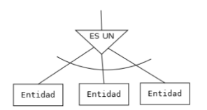
- **Inclusiva** (con solapamiento): Una ocurrencia de la entidad superconjunto puede ser na ocurrencia de varias entitades subconjunto a la vez. Se representa sin poner arco.  
- 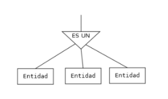
---
- **Total** (obligatoria): Una ocurrencia de la entidad superconjunto debe ser una ocurrencia de alguna entidad subconjunto. Se representa gráficamente con un círculo sobre la relación es_un.
- 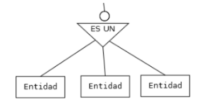
- **Parcial** (opcional): Una ocurrencia de la entidad superconjunto puede no ser una ocurrencia de ninguna entidad subconjunto. Se representa gráficamente sin el círculo.
- 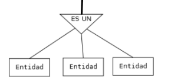
---

- Por lo tanto, una relación jerárquica puede ser:
  - Exclusiva total
  - Exclusiva parcial
  - Inclusiva total
  - Inclusiva parcial
  
- Ejemplos
  1. Exclusiva total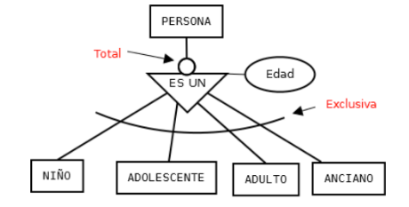
  2. Exclusiva parcial 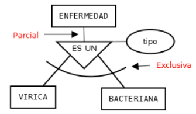
  3. Inclusiva total 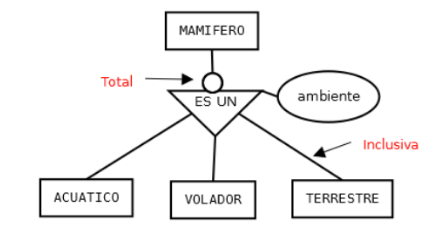
  4. Inclusiva parcial 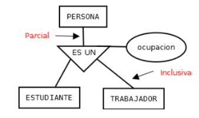

#### Reglas para construir el modelo Entidad/Relación Extendido ####
- Herencia de los atributos: Cuando todas las entidades subtipo tienen todas un mismo atributo se sube a la entidad supertipo.
- Relaciones con las entidades subtipo: En un modelo E/R Extendido, las entidades se pueden relacionar con la entidad supertipo o con las entidades subtipo. 
- Hay varios casos en los que se debe mantener la relación entre la entidad y la entidad subtipo:
  - Cuando una entidad sólo se relaciona con una de las entidades subtipo.
  - Cuando las relaciones entre una entidad y las entidades subtipo tienen cardinalidades distintas. O cuando la participación de las entidades en la relación es distinta.
  - Cuando alguna de las relaciones entre la entidad y las entidades subtipo tienen atributos propios y el resto no o son diferentes atributos.
